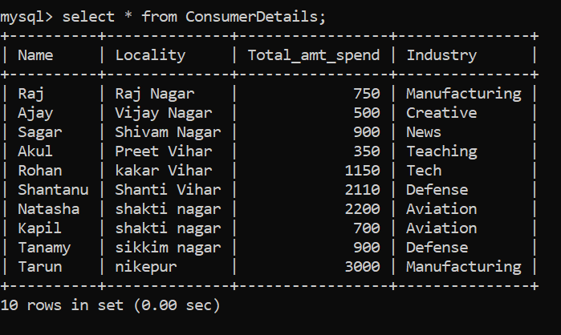

# Article 01

## 08 SQL Techniques to perform Data Analysis for Data Science

Link = https://www.analyticsvidhya.com/blog/2020/07/8-sql-techniques-data-analysis-analytics-data-science/

## Contents
01. Counting Rows & Items
02. Aggregation Functions
03. Extreme Value Identification
04. Slicing Data
05. Limiting Data
06. Sorting Data
07. Filtering Patterns
08. Grouping, Rolling up Data and Filtering in Groups

## Data set
To perform the above sql techniques we have created the below table.

Q1) Write a query to to count the number of rows in the table ?
SELECT COUNT(*) FROM ConsumerDetails;

Q2) What is the query to count the distinct values in the Industry column?
SELECT COUNT(DISTINCTCOUNT Industry) FROM ConsumerDetails;

Q3) We need to find the consumers from a locality, specifically Shakti Nagar and Shanti Vihar. What will be the query for this?

Q4) What will you do if you just want to select only the fourth and fifth rows?
We will make use of the OFFSET clause

Q5) How to find records when localities endswith ''Nagar" ?
SELECT * FROM consumerdetails WHERE Locality LIKE "%Nagar"

Q6) How to find the number of customers corresponding to the specific industries?
SELECT COUNT(*), Industry from consumerdetails group by Industry

## Notes
01. A lot of times, our data table is filled with duplicate values. To attain the unique value, we use the DISTINCT function.

02. Aggregation functions are the base of any kind of data analysis. They provide us with an overview of the dataset. (SUM(), AVG(), STDDEV()).

03. IN operator which allows us to specify multiple values in the WHERE clause.

04. LIMIT helps to view the limited number of rows.

05. We can perform the sorting process by using the keyword – ORDER BY. We can sort the data in ascending and descending order by using ORDER BY keyword. To perform descending order we can use DESC keyword.

06. The LIKE operator is used in a WHERE clause to search for a specified pattern in a column.

07. Grouping of data which is performed using the GROUP BY statement. The most useful application of this statement is to find the distribution of categorical variables. This is done by using the GROUP BY statement along with aggregation functions like – COUNT, SUM, AVG, etc.

08. The HAVING clause is just like the WHERE clause but only for filtering the grouped by data. Remember, it will always come after the GROUP BY statement.

