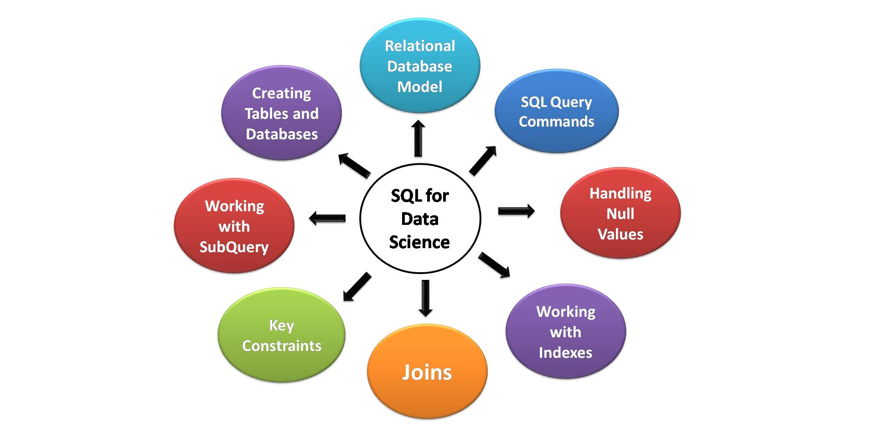

# Article 01

Link = https://www.analyticsvidhya.com/blog/2021/06/sql-for-data-science-a-beginners-guide/

Important Points
01. SQL is used to handle structured data. As the structured data is stored in relational databases. 

02. Big Data Platforms like Hadoop and Spark provide an extension for querying using SQL commands for manipulating.

# Key Elements of SQL

# MySQL with Python
MySQL is a server-based database management system. One MySQL server can have multiple databases. A MySQL database consist two-step process for creating a database:
01. Make a connection to a MySQL server.

02. Execute separate queries to create the database and process data.

