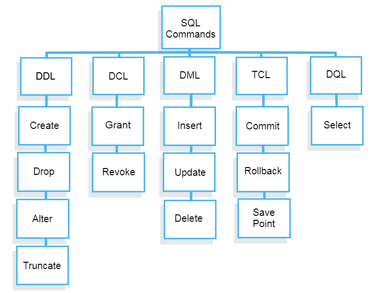

# SQL Interview Questions You Must Prepare: The Ultimate Guide

[Article Link](https://towardsdatascience.com/sql-interview-questions-you-must-prepare-the-ultimate-guide-12f0546bfb8f)

Data Definition Language (DDL)
- CREATE
- ALTER
- DROP
- RENAME
- TRUNCATE
- COMMENT

Data Query Language (DQL)
- SELECT

Data Manipulation Language (DML)
- INSERT
- UPDATE
- DELETE
- MERGE
- CALL
- EXPLAIN PLAN
- LOCK TABLE

Data Control Language (DCL)
- GRANT
- REVOKE

## Technical Concepts tested in SQL Interview Questions

1. Fundamental SQL concepts
2. SQL basics interview questions
3. SQL aggregation interview questions
4. Open Ended SQL interview questions
5. Data Transformation interview questions
6. Database Modeling interview questions
7. Software Engineering SQL Interview questions

### Fundamental SQL Concepts

#### General information about SQL
Q1. What is SQL?

- SQL - Structured Query Language.

- SQL lets you access and manipulate databases.

Q2. What are the different flavors of SQL?

MySQL, MS SQL Server, PostgreSQL, SQLite, ORACLE PL/SQL

Q3. What is a primary key?

- Primary keys must be unique values.
- Cannot contain NULL values.
- Uniquely identifies records in a table.
- A primary key is a field in a table which uniquely identifies each row/record in a database table.
- A table can have only one primary key, which may consist of single or multiple fields. When multiple fields are used as a primary key, they are called a composite key.

#### Relational Databases and how they work?
Q1. What are the top RDBMS engines?

- SQL Server.
- PostgreSQL.
- IBM DB2.
- Microsoft Access.
- SQLite.
- MariaDB.
- Informix.
- Azure SQL.

Q2. How is an RDBMS different from a No-SQL database?

- SQL databases are table based databases whereas NoSQL databases can be document based, key-value pairs, graph databases.
- SQL databases are vertically scalable while NoSQL databases are horizontally scalable.
- SQL databases have a predefined schema whereas NoSQL databases use dynamic schema for unstructured data.
- SQL databases have a predefined schema whereas NoSQL databases use dynamic schema for unstructured data.

#### SQL sublanguages and their main keywords
Q1. What do DDL, DCL, and DML stand for?

- DDL - Data Definition Language

- DCL - Data Control Language

- DML - Data Manipulating Language

Q2. Give examples of commands for each.

  

#### Data types and how SQL handles it (including blanks and NULLs)
Q1. What are the common data types in SQL?

- Numeric - int, float, decimal, real, smallint, tinyint, bit, bigint

- Date / Time - date, time, datetime, timestamp, year

- Character / String - Char, Varchar, Text

- Unicode Character / String - NChar, NVarcar, NText

- Binary - Binary, Varbinary, image

- Miscellaneous - Clob, Blob, XML, JSON

Q2. Does an SQLite database support date time objects?

SQLite does not support built-in date and/or time storage class

#### Attribute constraints
Q1. What are attribute constraints, and explain them?

Constraints are the rules enforced on the data columns of a table.

- NOT NULL CONSTRAINT - Ensures that a column cannot have a NULL value

- DEFAULT CONSTRAINT - Provides a default value for a column when none is specified.

- UNIQUE CONSTRINT - Ensures that all values in a column are different.

- PRIMARY KEY - Uniquily identifies each row/ record in a database table.

- FOREIGN KEY - Uniquely identifies a row/ record in any of the given database table.

- INDEX - Used to create and retrieve data from the database very quickly.

#### Types of JOINS
Q1. What is the difference between inner join and left outer join?

